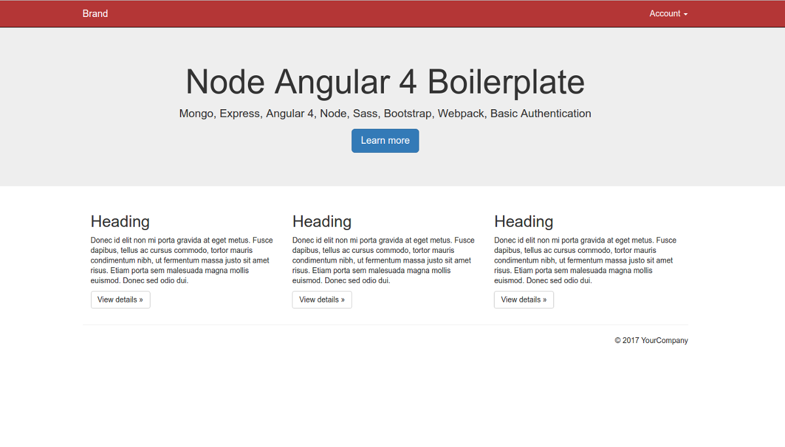

# node-ng4-boiler
Angular 4, NodeJS, Express, Mongo, Sass, Bootstrap, boilerplate with basic user authentication



More Screenshots [1](https://github.com/hutchgrant/node-ng4-boiler/raw/master/screenshots/screen_1.png), [2](https://github.com/hutchgrant/node-ng4-boiler/raw/master/screenshots/screen_2.png), [3](https://github.com/hutchgrant/node-ng4-boiler/raw/master/screenshots/screen_3.png)

## Procedure

```
git clone https://github.com/hutchgrant/node-ng4-boiler
cd ./node-ng4-boiler && npm install
npm run build:prod
npm run start
```

To open, browse to http://localhost:3000

Register an account and login

## Development

```
npm run build
npm run start
```

## Production

```
npm run build:prod
npm run start
```

## License

node-ng4-boiler is available under the [MIT License](https://github.com/hutchgrant/node-ng4-boiler/blob/master/LICENSE).

## Contributing

All contributions will be placed under the same MIT license, contributers must agree to that license.
For more information see [contributing](https://github.com/hutchgrant/node-ng4-boiler/blob/master/CONTRIBUTING.md).

## Creator

**Grant Hutchinson (hutchgrant)**
